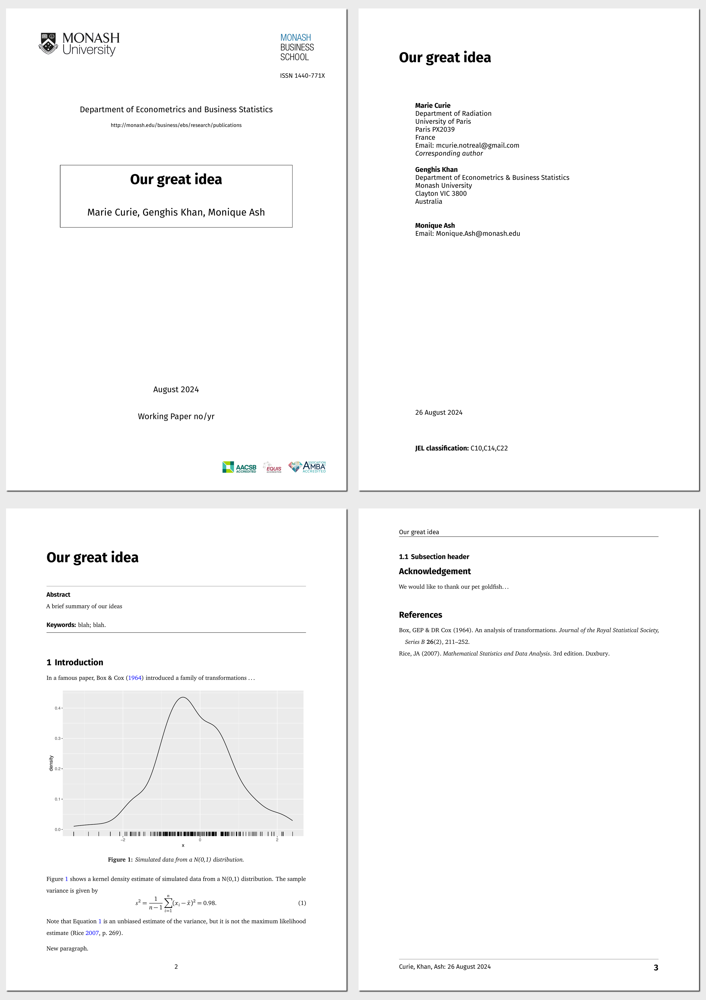

<!-- README.md is generated from README.qmd. Please edit that file -->

# Monash Working Paper Format Template

This is a Quarto template that assists you in creating a working paper
for the Department of Econometrics & Business Statistics, Monash
University.

## Creating a new working paper

You can use this as a template to create a working paper. To do this,
use the following command:

``` bash
quarto use template quarto-monash/workingpaper
```

This will install the extension and create an example qmd file that you
can use as a starting place for your working paper.

## Installation for existing document

You may also use this format with an existing Quarto project or
document. From the quarto project or document directory, run the
following command to install this format:

``` bash
quarto install extension quarto-monash/workingpaper
```

## Example

[](examples/template.pdf)
